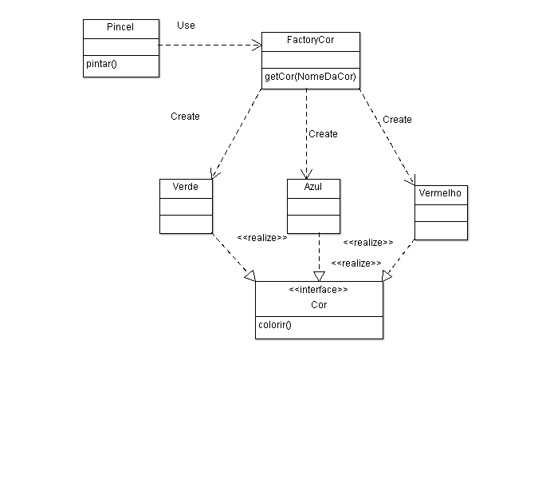

## Factory Method

 - Se refere a uma classe específica responsável em criar e retornar objetos específicos.
 - "Subclasses decidem quais objetos criar".

   
 

  

#### java source code credits: https://github.com/thiagotoledo/factory-method