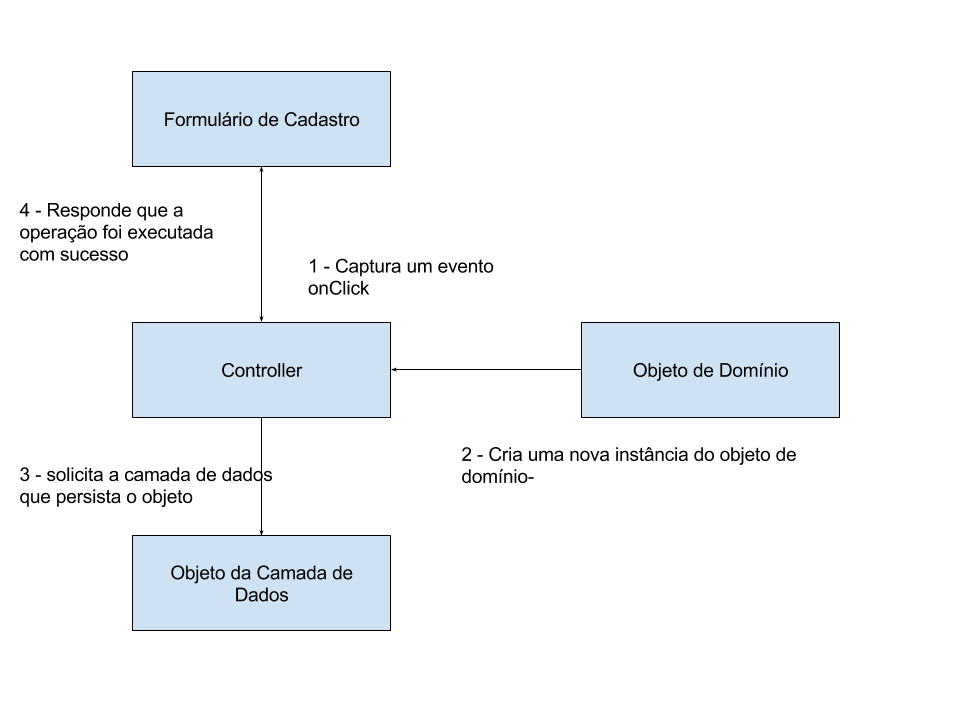

## GRASP - Controller

#### Source/Credits: http://ramonsilva.net/boas-praticas/grasp/principios-grasp-controller/

 - O primeiro padrão do catalogo GRASP, é o Controller, este padrão é responsável por atribuir eventos do sistema a classes que que não estão relacionadas com interface com o usuário.

 - Atribuições da Controller
    - Determina quais objetos são responsáveis por tratar eventos gerados na camada de interface com o usuário.
    - Delega responsabilidades a outras classes e coordena a interação dos principais objetos.
    - Funciona como uma fachada para interação com o sistema
    - Determina quais operações o sistema e capaz de realizar.
    - Determinar quais mensagens são enviadas ao usuário.

 - Exemplo de uso de uma Controller
    - Suponha que temos um formulário de cadastro, que possui alguns campos texto e um botão Salvar. 
    - Quando o usuário clica no botão, os sistema dispara um evento onClick, e a Controller  captura esse evento,  e faz uma chamada para a classe responsável por armazenar os  valores destes campos no banco de dados. 
    - Ao final, a classe de persistência informa que terminou  e a Controller então delega a um novo elemento de interface com usuário a tarefa de informar o termino da operação.

    
  

 - Funcionamento da Controller
 - Um objeto funciona como um Controller quando
    - o objeto representa o sistema como um todo, ou;
    - o objeto representa um caso de uso inteiro, com por exemplo operações de cadastro de dados, lidando com toda a sequencia de eventos.

 - Beneficios do Controller
    - você pode reutilizar o mesmo Controller para todas as operações que envolva um determinado objeto de domínio.
    - usar para manter um estado de um caso de uso durante uma sequência de operações.
    - usar para controlar um sequência de atividades do sistema.

 - Controller Inchados
    - possui muitas responsabilidades, violando a SRP. ( exemplo controlar a persistência de muitos objetos de domínio heterogêneos)
    - realiza muitas tarefas ao invés de delegar a outros objetos.
 - Conclusão
    - Este padrão, funciona como uma camada de indireção para eventos do sistema. Deixando os eventos gerados pela Interface desacoplados dos objetos responsáveis por tratar a requisição, tornando o sistema mais flexível de de fácil manutenção.
