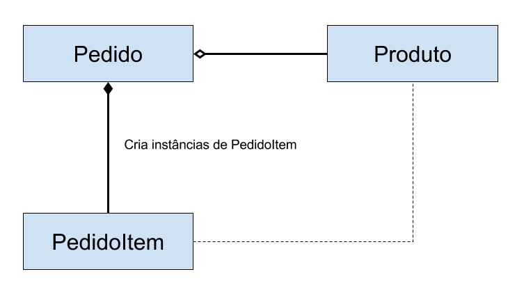

## GRASP - Creator

#### Source/Credits: http://ramonsilva.net/boas-praticas/grasp/creator-padroes-grasp/

 - O segundo padrão do catalogo GRASP, é o Creator, este padrão é responsável por atribuir a responsabilidade de criação de objetos.
 - Atribuições do Creator
    - O paradigma da orientação a objetos trata-se de uma coleção de objetos que interagem entre si, mas a quem cabe a atribuição de criar esses objetos? Afinal se qualquer  classe sair criando objetos, podemos ter graves violações de encapsulamento, responsabilidades e  alto acoplamento.
 - O padrão Creator veio para dar ordem a esse caos, segundo o padrão, para uma classe B ter a responsabilidade de criar instâncias de outra classe A, ele deve obedecer a mais de um dos requisitos abaixo:
	- B agrega objetos da classe A.
	- B contém objetos da classe A.
	- B registra instâncias da classe A.
	- B usa muitos objetos da classe A.
	- B possui os dados usados para inicializar A.
 - Uso de um Creator
    - O uso mais comum creator é quando criamos um Factory para encapsular criação instâncias de nossos objetos. Assim o objeto consumidor apenas decide qual instancia quer utilizar. Quando usamos o padrão de Inversão de Dependências, criamos uma camada de abstração intermediaria que fica responsável por criar as instancias dos objetos e relaciona-los.
 - Exemplo de Uso do Creator
   - Supondo que temos uma classe pedido, ela possui itens do pedido, esses itens são criados a partir dos dados de um produto.
 
 <br>
 <p align="center">
    
  </p>
 <br>

 - Pedido fica responsável por criar instâncias de PedidoItem
   - Pedido fica responsável por criar instâncias de PedidoItem
 - Uso correto do creator
```java
class Pedido {

    private List itens;
    
    public void criarNovoPedidoItem(Produto produto) {
        //Criamos a instancia de pedido item
        PedidoItem pedidoItem = new PedidoItem(produto);
        this.itens.add(pedidoItem);
    }
}

class Produto {
    
    private String nome;
    private String preco;
    
}

class PedidoItem {
    
    private String nome;
    private String precoUnitario;
    private int quantidade;
    
    public PedidoItem(Produto produto){
        this.nome = produto.getNome();
        this.precoUnitario = produto.getPreco();
        this.quantidade = 1;
    }
    
}
```

 - Abaixo temos como seria se não usássemos o creator.

```java
 public static void main(String[] args){
    
    //Criamos a instancia de pedido
    Pedido pedido = new Pedido();
    
    //Criamos um produto
    Produto produto = new Produto();
    produto.setNome("Fatia de Pizza");
    produto.setPreco(3.50);
    
    //Criamos o pedido item, violando o encapsulamento
    PedidoItem pedidoItem = new PedidoItem(produto);
    
    //E ficamos sabendo a implementacao interna do objeto pedido
    pedido.getItens().add(pedidoItem);
    
}
 ```

 - Conclusão
    - O Padrão Creator foi criado para dar ordem no caos que pode se tornar a criação de Objetos no sistema, atribuindo a responsabilidade de criação ã classes que realmente fazem sentido ter essa atribuição. Desse modo seu código fica mais fácil de manter e de testar.