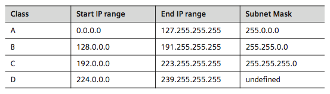
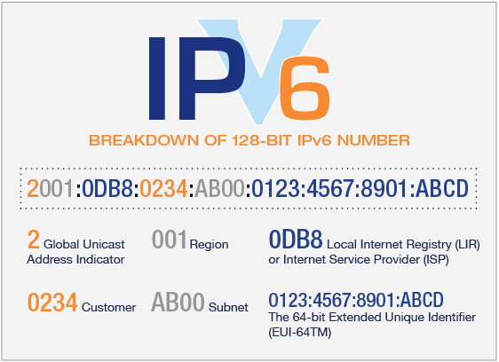
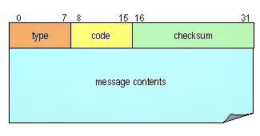
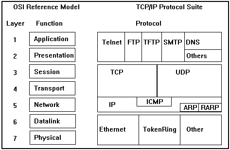
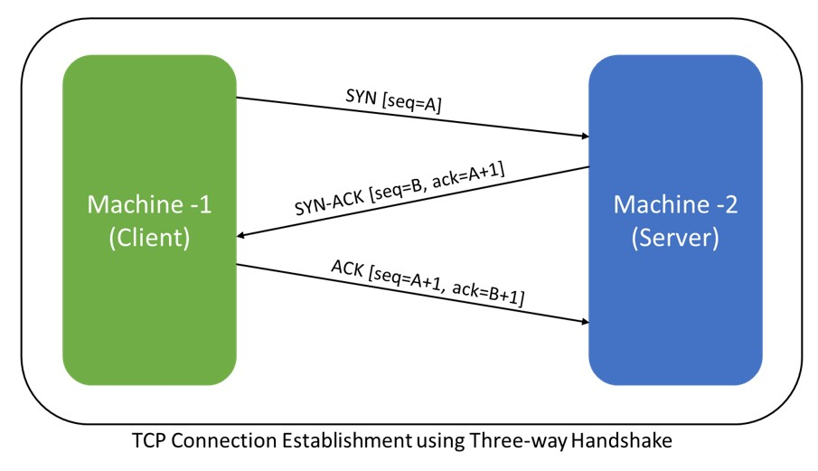
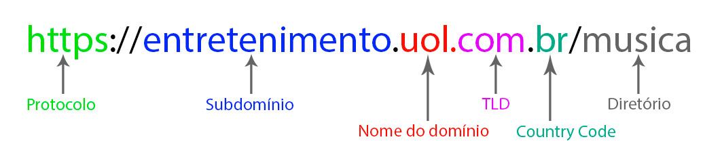
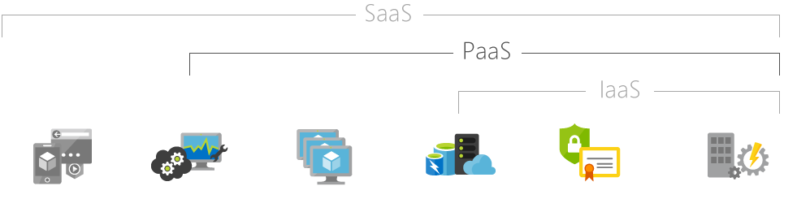

## Fast HTTP Server

    $ cd project-folder
    $ php -S localhost:8000

## References

 - Courses
    - [PHP Do Zero ao Profissional](https://phpdozeroaoprofissional.com.br/)
    - [Curso Completo de PHP7 - Udemy](https://www.udemy.com/curso-php-7-online/learn/v4/overview)
 - Recommended Books
    - [PHP Programando com Orientação a Objetos - 4 Edição - Pablo Dall'Oglio](https://www.amazon.com.br/PHP-Programando-com-Orienta%C3%A7%C3%A3o-Objetos-ebook/dp/B07G9PQJQR?tag=goog0ef-20&smid=A18CNA8NWQSYHH&ascsubtag=3f9e3157-63ef-45ba-8931-20a081aa9ab1)
 - YouTube
    - [NICbrvideos](https://www.youtube.com/user/NICbrvideos/videos)
 - Sites
    - [NIC.br](https://nic.br/)
    - [Tutorial Republic](https://www.tutorialrepublic.com/php-tutorial/)
    - [Celke.com.br](https://celke.com.br/home)
    - [EnableCORS.org](https://enable-cors.org/)
    - [Php Weekend](http://phpweekend.com.br/)
 - Security
    - [OAuth.net](https://oauth.net/)
       - [Build a Simple REST API with Node and OAuth 2.0](https://developer.okta.com/blog/2018/08/21/build-secure-rest-api-with-node)
       - [GitHub Source code for OAuth 2 in Action](https://github.com/oauthinaction/oauth-in-action-code)
    - [Practical Cryptography for Developers - Free Book](https://cryptobook.nakov.com/)
    - [HashKiller](https://hashkiller.co.uk/md5-decrypter.aspx) :skull:
 - Articles
    - ["Design Patterns" Aren't](https://perl.plover.com/yak/design/)
    - [Crontab](https://www.wikiwand.com/pt/Crontab)
    - [How To Install and Secure Redis on Ubuntu 18.04](https://www.digitalocean.com/community/tutorials/how-to-install-and-secure-redis-on-ubuntu-18-04)
 - SQLite
    - [When To Use](https://www.sqlite.org/whentouse.html)
 - Wordpress
    - [UnderScores.me](http://underscores.me/)
    - [BrowserShot](http://browsershots.org/)

## Best Practices

- [PSRs](https://www.php-fig.org/psr)
- [Design Patterns For Humans](https://github.com/kamranahmedse/design-patterns-for-humans)
- [PHP The Right Way - Github](https://github.com/PHPSP/php-the-right-way)
- [FIG Standards Aproved- GitHub](https://github.com/php-fig/fig-standards/tree/master/accepted)
- [PHPBestPractices.org](https://phpbestpractices.org)

## Unix Permissions

 - Change Mode "chmod" command
    ```
    Permissão Binário   Octal
    ---        000       0
    --x        001       1
    -w-        010       2
    -wx        011       3
    r--        100       4
    r-x        101       5
    rw-        110       6
    rwx        111       7

    x -> execute 
    w -> write
    r -> read

    owner  group  general  unix command      when to use
    ---   ---     ---
    rwx   rwx     rwx 
    421   401     401      sudo chmod 755   -> permissions to directories in production
    420   400     400      sudo chmod 644   -> permissions to files in production
    ```
 - Give all permissions recursively to all files and directories inside the folder
    ```
    $ sudo chmod -R 777 folder/
    ```

## .htaccess

 - Force HTTPS Redirect (Apache HTTP Server)
   - Create .htaccess file inside folder
   - Change example.com to URL https redirection
   ```
   RewriteEngine On 
   RewriteCond %{SERVER_PORT} 80 
   RewriteRule ^(.*)$ https://example.com/$1 [R=301,L]
   ```
- Removing ‘www.’ from your URL (Apache HTTP Server)
   - Create .htaccess file inside folder
   - Change example.com to URL redirection
   ```
   RewriteEngine On
   RewriteCond %{HTTP_HOST} !^example\.com [NC]
   RewriteRule ^(.*)$ https://example.com%{REQUEST_URI} [R=301,L]
   ```

## Apache HTTP Server Configurations

 - [Docs Apache HTTP Server PT-BR](https://httpd.apache.org/docs/trunk/pt-br/)
 - Create New VirtualHost
 ```
 $ cd /opt/lampp/apache2/conf
 $ sudo nano httpd.conf

 <VirtualHost *:80>
    ServerAdmin aleexgvieira@gmail.com
    DocumentRoot "/opt/lampp/htdocs/Learning-PHP7/Platform as a service (Multitenancy)"
    ServerName saas.galhardoo.com
    ServerAlias saas.galhardoo.com
    ErrorLog "logs/saas.galhardoo.com-error_log"
    CustomLog "logs/saas.galhardoo.com-access_log" common
</VirtualHost>
 ```
 - Rename LocalHost
 ```
 $ sudo nano /etc/hosts
 
 127.0.0.1   new_localhost_url_here
 127.0.0.1   new_localhost_url_here
 ```

## Bytes World

 - [American Standard Code for Information Interchange Table](https://www.ascii-code.com/)
 - 1Kbit = 2^10 = 1024 bits
 - 1KByte = 2^10 * 8 = 8.192 bits
 - 1Mbit = 2^20 = 1.048.576 bits 
 - 1MByte = 2^20 * 8 = 8.388.608 bits
 - 20Mbits = 20 * 2^20 = 20.971.520 bits
 - 20MByte = 20 * 2^20 * 8 = 167.772.160 bits
 - Plano de 100Mbits = (100 * 2^20) / 8 = 104.857.600 / 8 = 13.107.200 bits/s = 13MB/s 
 - Data Types
     ```
     Integer Types
     Type               Storage size    Value range

     char               1 byte          -128 to 127 or 0 to 255
     unsigned char      1 byte          0 to 255
     signed char        1 byte          -128 to 127
     int                2 or 4 bytes    -32,768 to 32,767 or -2,147,483,648 to 2,147,483,647
     unsigned int       2 or 4 bytes    0 to 65,535 or 0 to 4,294,967,295
     short              2 bytes         -2,147,483,64832,768 to 32,767
     unsigned short     2 bytes         0 to 65,535
     long               4 bytes         -2,147,483,648 to 2,147,483,647
     unsigned long      4 bytes         0 to 4,294,967,295


     Floating-Point Types
     Type               Storage size        Value range             Precision

     float              4 byte              1.2E-38 to 3.4E+38      6 decimal places
     double             8 byte              2.3E-308 to 1.7E+308    15 decimal places
     long double        10 byte             3.4E-4932 to 1.1E+4932  19 decimal places

     ```

## MySQL

 - Usefull Commands
    - $ nmap localhost
 - Uninstall or Completely remove mysql from ubuntu
    - sudo apt-get remove --purge mysql*
    - sudo apt-get purge mysql*
    - sudo apt-get autoremove
    - sudo apt-get autoclean
    - sudo apt-get remove dbconfig-mysql
    - sudo apt-get dist-upgrade
    - sudo apt-get install mysql-server
 - Training
    - https://www.sqlteaching.com/
 - Ports
    - MySQL: 3306
    - MSSQL: 1433
 - Install MySQL Ubuntu 18.04
 ```
 $ sudo apt-get install mysql-server mysql-client libmysqlclient-dev
 ```
 - GUI Software
    - [DBeaver](https://dbeaver.io/)
    - [MySQLWorkBench](https://www.mysql.com/products/workbench/)
    - [SequelPRO - MacOS Only](http://www.sequelpro.com/)
 - CLI Commands Reference
    - Source/Credits: https://gist.github.com/hofmannsven/9164408
    - Access monitor: mysql -u [username] -p; (will prompt for password)
    - Show all databases: show databases;
    - Access database: mysql -u [username] -p [database] (will prompt for password)
    - Create new database: create database [database];
    - Select database: use [database];
    - Determine what database is in use: select database();
    - Show all tables: show tables;
    - Show table structure: describe [table];
    - List all indexes on a table: show index from [table];
    - Create new table with columns: CREATE TABLE [table] ([column] VARCHAR(120), [another-column] DATETIME);
    - Adding a column: ALTER TABLE [table] ADD COLUMN [column] VARCHAR(120);
    - Adding a column with an unique, auto-incrementing ID: ALTER TABLE [table] ADD COLUMN [column] int NOT NULL AUTO_INCREMENT PRIMARY KEY;
    - Inserting a record: INSERT INTO [table] ([column], [column]) VALUES ('[value]', [value]');
    - MySQL function for datetime input: NOW()
    - Selecting records: SELECT * FROM [table];
    - Explain records: EXPLAIN SELECT * FROM [table];
    - Selecting parts of records: SELECT [column], [another-column] FROM [table];
    - Counting records: SELECT COUNT([column]) FROM [table];
    - Counting and selecting grouped records: SELECT *, (SELECT COUNT([column]) FROM [table]) AS count FROM [table] GROUP BY [column];
    - Selecting specific records: SELECT * FROM [table] WHERE [column] = [value]; (Selectors: <, >, !=; combine multiple selectors with AND, OR)
    - Select records containing [value]: SELECT * FROM [table] WHERE [column] LIKE '%[value]%';
    - Select records starting with [value]: SELECT * FROM [table] WHERE [column] LIKE '[value]%';
    - Select records starting with val and ending with ue: SELECT * FROM [table] WHERE [column] LIKE '[val_ue]';
    - Select a range: SELECT * FROM [table] WHERE [column] BETWEEN [value1] and [value2];
    - Select with custom order and only limit: SELECT * FROM [table] WHERE [column] ORDER BY [column] ASC LIMIT [value]; (Order: DESC, ASC)
    - Updating records: UPDATE [table] SET [column] = '[updated-value]' WHERE [column] = [value];
    - Deleting records: DELETE FROM [table] WHERE [column] = [value];
    - Delete all records from a table (without dropping the table itself): DELETE FROM [table]; (This also resets the incrementing counter for auto generated columns like an id column.)
    - Delete all records in a table: truncate table [table];
    - Removing table columns: ALTER TABLE [table] DROP COLUMN [column];
    - Deleting tables: DROP TABLE [table];
    - Deleting databases: DROP DATABASE [database];
    - Custom column output names: SELECT [column] AS [custom-column] FROM [table];
    - Export a database dump (more info here): mysqldump -u [username] -p [database] > db_backup.sql
    - Use --lock-tables=false option for locked tables (more info here).
    - Import a database dump (more info here): mysql -u [username] -p -h localhost [database] < db_backup.sql
    - Logout: exit;
    - Select but without duplicates: SELECT distinct name, email, acception FROM owners WHERE acception = 1 AND date >= 2015-01-01 00:00:00
    - Calculate total number of records: SELECT SUM([column]) FROM [table];
    - Count total number of [column] and group by [category-column]: SELECT [category-column], SUM([column]) FROM [table] GROUP BY [category-column];
    - Get largest value in [column]: SELECT MAX([column]) FROM [table];
    - Get smallest value: SELECT MIN([column]) FROM [table];
    - Get average value: SELECT AVG([column]) FROM [table];
    - Get rounded average value and group by [category-column]: SELECT [category-column], ROUND(AVG([column]), 2) FROM [table] GROUP BY [category-column];
    - Select from multiple tables: SELECT [table1].[column], [table1].[another-column], [table2].[column] FROM [table1], [table2];
    - Combine rows from different tables: SELECT * FROM [table1] INNER JOIN [table2] ON [table1].[column] = [table2].[column];
    - Combine rows from different tables but do not require the join condition: SELECT * FROM [table1] LEFT OUTER JOIN [table2] ON [table1].[column] = [table2].[column]; (The left table is the first table that appears in the statement.)
    - Rename column or table using an alias: SELECT [table1].[column] AS '[value]', [table2].[column] AS '[value]' FROM [table1], [table2];
    - List all users: SELECT User,Host FROM mysql.user;
    - Create new user: CREATE USER 'username'@'localhost' IDENTIFIED BY 'password';
    - Grant ALL access to user for * tables: GRANT ALL ON database.* TO 'user'@'localhost';
    - SHOW VARIABLES WHERE Variable_name = 'hostname'; (source)

## PostgreSQL

 - Ports
    - Default: 5432
 - Install PostgreSQL Ubuntu 18.04
 ```
 $ sudo sh -c "echo 'deb http://apt.postgresql.org/pub/repos/apt/ xenial-pgdg main' > /etc/apt/sources.list.d/pgdg.list"
 $ wget --quiet -O - http://apt.postgresql.org/pub/repos/apt/ACCC4CF8.asc | sudo apt-key add -
 $ sudo apt-get update
 $ sudo apt-get install postgresql-common
 $ sudo apt-get install postgresql-9.5 libpq-dev
 ```
 - The postgres installation doesn't setup a user for you, so you'll need to follow these steps to create a user with permission to create databases. 
 ```
 $ sudo -u postgres createuser galhardo -s
 ```
 - If you would like to set a password for the user, you can do the following
 ```
 $ sudo -u postgres psql
 $ postgres=# \password root
 ```

## Redes

 - <strong>Resumindo os principais tópicos para usar como referência, como se fosse um mapa mental.</strong>
 - IPv4
    - Significado Internet Protocol Versão 4
    - Formato por 4 bytes (10111011.01101011.11111011.01011011) = 2^32 = 4.294.967.296
    - Example: 192.168.0.1
    - 
 - IPv6
    - Versão 6, por falta de endereços suficientes atualmente
    - 3,4x10^38 endereços
    - 
 - MacAddress
    - Endereço "único" físico associado à interface de comunicação, que conecta um dispositivo à rede
    - Sua identificação é gravada em hardware, isto é, na memória ROM (Read-Only-Memory)
    - Os três primeiros bytes são destinados a identificação do fabricante - eles são fornecidos pela própria IEEE
    - Os três últimos bytes são definidos pelo fabricante, sendo este responsável pelo controle da numeração de cada placa que produz. Apesar de ser único e gravado em hardware, o endereço MAC pode ser alterado através de técnicas específicas.
    - 
 - HTTP
    - HyperText Transfer Protocol utilizado para sistemas de informação de hipermídia e hypertexto
    - [MDN HTTP Headers](https://developer.mozilla.org/en-US/docs/Web/HTTP/Headers)
    ```
    HTTP: Port 80
    HTTPS: Port 443
    ```
 - OSI & TCP/IP
    - <strong>Transmission Control Protocol</strong> é um conjunto de protocolos de comunicação entre computadores em rede. O conjunto de protocolos pode ser visto como um modelo de camadas (Modelo OSI), onde cada camada é responsável por um grupo de tarefas, fornecendo um conjunto de serviços bem definidos para o protocolo da camada superior. As camadas mais altas, estão logicamente mais perto do usuário (chamada camada de aplicação) e lidam com dados mais abstratos, confiando em protocolos de camadas mais baixas para tarefas de menor nível de abstração. <strong>É orientado a conexão, ou seja, antes de enviar os dados é feito uma comunicação entre o rementente e o destinatário e cria-se um canal de comunicação, então é transmitido os dados. Exemplo de uso: gerenciadores de FTP (File Transfer Protocol), como o FileZilla, pois precisam garantir a integridade do recebimento/envio do arquivo.</strong>
    - Benefícios
       - Padronização: um padrão, um protocolo roteável que é o mais completo e aceito protocolo disponível atualmente. Todos os sistemas operacionais modernos oferecem suporte para o TCP/IP e a maioria das grandes redes se baseia em TCP/IP para a maior parte de seu tráfego.
       - Interconectividade: uma tecnologia para conectar sistemas não similares. Muitos utilitários padrões de conectividade estão disponíveis para acessar e transferir dados entre esses sistemas não similares, incluindo FTP (File Transfer Protocol) e Telnet (Terminal Emulation Protocol).
       - Roteamento: permite e habilita as tecnologias mais antigas e as novas a se conectarem à Internet. Trabalha com protocolos de linha como P2P (Point to Point Protocol) permitindo conexão remota a partir de linha discada ou dedicada. Trabalha como os mecanismos IPCs e interfaces mais utilizados pelos sistemas operacionais, como sockets do Windows e NetBIOS.
       - Protocolo Robusto: escalável, multiplataforma, com estrutura para ser utilizada em sistemas operacionais cliente/servidor, permitindo a utilização de aplicações desse porte entre dois pontos distantes.
       - Internet: é através da suíte de protocolos TCP/IP que obtemos acesso a Internet. As redes locais distribuem servidores de acesso a Internet (proxy servers) e os hosts locais se conectam a estes servidores para obter o acesso a Internet. Este acesso só pode ser conseguido se os computadores estiverem configurados para utilizar TCP/IP.
    - Total de Portas TCP: 2^16 = 65.536
    - <strong>UDP = User Datagram Protocol</strong> é um protocolo simples da camada de transporte. Ele é descrito na RFC 768 e permite que a aplicação envie um datagrama encapsulado num pacote IPv4 ou IPv6 a um destino, porém sem qualquer tipo de garantia que o pacote chegue corretamente (ou de qualquer modo). <strong>Não é orientado a conexão, portanto os dados são enviados sem ter a certeza de que o receptor recebeu os dados. Exemplo de uso: são aqueles que não precisam de garantir a chegada dos dados. Todos os programas de video e voz são do tipo UDP (skype, todos os programas do tipo "Voz sobre IP" e streaming de videos). </strong>
    - <strong>ICMP = Internet Control Message Protocol</strong> é um protocolo integrante do Protocolo IP, definido pelo RFC 792, é utilizado para fornecer relatórios de erros à fonte original. Qualquer computador que utilize IP precisa aceitar as mensagens ICMP e alterar o seu comportamento de acordo com o erro relatado.
       - TYPE (8 bits): identifica o tipo mensagem, por exemplo, se o valor for 8 é uma requisição (echo request). Se o conteúdo for 0 é uma reposta (echo reply).
       - CODE (8 bits): utilizado em conjunto com o campo TYPE para identificar o tipo de mensagem ICMP que está sendo enviada.
       - CHECKSUM (16 bits): verifica a integridade do pacote ICMP.
       - MESSAGE CONTENTS (Tamanho Variável): contém o conteúdo da mensagem ICMP.
    - 
    - <strong>Open System Interconnection</strong> é um modelo de rede de computador com objetivo de ser um padrão, para protocolos de comunicação entre os mais diversos sistemas em uma rede local (Ethernet), garantindo a comunicação entre dois sistemas computacionais (end-to-end) divido em 7 camadas.
    - <strong>PING ou Latência</strong> é um utilitário que usa o protocolo ICMP para testar a conectividade entre equipamentos. É um comando disponível praticamente em todos os sistemas operacionais. Seu funcionamento consiste no envio de pacotes para o equipamento de destino e na "escuta" das respostas. Se o equipamento de destino estiver ativo, uma "resposta" (o "pong", uma analogia ao famoso jogo de ping-pong) é devolvida ao computador solicitante. $ ping -c 5 galhardoo.com
    - <strong>Firewal ou Parede de Fogo</strong> é um dispositivo de uma rede de computadores que tem por objetivo aplicar uma política de segurança a um determinado ponto da rede. O firewall pode ser do tipo filtros de pacotes, proxy de aplicações, etc. Os firewalls são geralmente associados a redes TCP/IP.[1]. Este dispositivo de segurança existe na forma de software e de hardware, a combinação de ambos é chamado tecnicamente de "appliance".
    - <strong>Gateway = Ponte de ligação</strong>  possui os seguintes significados:
       - Em uma rede de comunicações, um nó de rede equipado para interfacear com outra rede que usa protocolos diferentes. 
       - Um computador ou programa de computador configurado para realizar as tarefas de um gateway.
       - Para que serve: Organizar o tráfego de informações entre um equipamento final (computador, notebook, smartphone, tablet, etc) e a internet além de “traduzir” as informações entre redes heterogêneas. Isto é, permitir a comunicação entre diferentes ambientes e arquiteturas. Assim, a ferramenta é capaz de converter os dados entre sistemas diferentes, de modo que cada lado seja capaz de “entender” o outro.
       - Exemplos de uso: roteador e firewall.
    - <strong>Proxy = "Procurador ou Representante"</strong> é um servidor (um sistema de computador ou uma aplicação) que age como um intermediário para requisições de clientes solicitando recursos de outros servidores. Um cliente conecta-se ao servidor proxy, solicitando algum serviço, como um arquivo, conexão, página web ou outros recursos disponíveis de um servidor diferente, e o proxy avalia a solicitação como um meio de simplificar e controlar sua complexidade. Um proxy de cache HTTP ou, em inglês, caching proxy, permite por exemplo que o cliente requisite um documento na World Wide Web e o proxy procura pelo documento na sua caixa (cache). Se encontrado, a requisição é atendida e o documento é retornado imediatamente. Caso contrário, o proxy busca o documento no servidor remoto, entrega-o ao cliente e salva uma cópia em seu cache. Isto permite uma diminuição na latência, já que o servidor proxy, e não o servidor original, é requisitado, proporcionando ainda uma redução do uso da largura de banda.
    - <strong>Traceroute</strong> é uma ferramenta de diagnóstico que rastreia a rota de um pacote através de uma rede de computadores que utiliza os protocolos IP e o ICMP. Seu funcionamento está baseado no uso do campo <strong>Time to Live (TTL)</strong> do pacote IPv4[8] destinado a limitar o tempo de vida dele. Este valor é decrementado a cada vez que o pacote é encaminhado por um roteador. Ao atingir o valor zero o pacote é descartado e o originador é alertado por uma mensagem ICMP TIME_EXCEEDED. $ traceroute galhardoo.com
    - <strong>PAN = Personal Area Network</strong>  é uma rede doméstica que liga recursos diversos ao longo de uma residência. Através da tecnologia Bluetooth e/ou cabo USB obtém-se uma rede PAN.
    - <strong>LAN = Local Area Network</strong> é um conjunto de hardware e software que permite a computadores individuais estabelecerem comunicação entre si, trocando e compartilhando informações e recursos. Estas redes são denominadas locais por cobrirem uma área bem limitada, porém com o avanço tecnológico a LAN tem ultrapassado os 100 m de cobertura para se estender a uma área maior
    - <strong>MAN = Metropolitan Area Network</strong> são redes maiores que as LANs. Este tipo de rede é caracterizada por ter um alcance maior que as do tipo LAN, abrangendo cidades próximas ou regiões metropolitanas, por exemplo. Em uma definição mais prática, imaginemos por exemplo, que uma empresa possui dois escritórios em uma mesma cidade e deseja que os computadores permaneçam interligados. Para isso existe a rede de área metropolitana, que conecta diversas redes locais dentro de algumas dezenas de quilômetros.
    - <strong>WAN = Wide Area Network</strong> é uma rede de computadores que abrange uma grande área geográfica, com frequência um país ou continente. Um exemplo clássico de uma rede tipicamente WAN é a própria Internet pelo fato de abranger uma área geográfica global, interligando países e continentes.
    - 
    - 

## Domain

 - 
 - URL = Uniform Resource Locator (Nome do Domínio)
    - https://galhardoo.com
 - Subdomínio
    - https://app.galhardoo.com
 - URN == Uniform Resource Name    
    - /blog (recurso que será usado na URL)
 - URI == Uniform Resource Identifier    
      - https://galhardoo.com/projetos (URL + URN)
 - TDL == Top Level Domain ou Domínio de Nível Superior
    - A IANA (Autoridade para Atribuição de Números na Internet) atualmente distingue os seguintes grupos de domínios de topo
       - domínios de topo de código de país (country-code top-level domains ou ccTLD): têm sempre duas letras e derivam do código ISO 3166-1 alpha-2
       - domínios de topo genéricos (generic top-level domains ou gTLD): têm sempre mais do que duas letras
       - domínios de topo patrocinados (sponsored top-level domains ou sTLD)
       - domínios de topo não patrocinados (unsponsored top-level domains)
       - domínios de topo de infraestruturas (infrastructure top-level domain)
       - domínios de topo internacionalizados (internationalized top-level domains ou IDN)
       - domínios de topo de código de país internacionalizado (internationalized country code top-level domains ou IDN ccTLD)
       - domínios de topo em teste (testing top-level domains)
 - DNS == Domain Name System
    - É um sistema hierárquico e distribuído de gerenciamento de nomes para computadores, serviços ou qualquer máquina conectada à Internet ou a uma rede privada.
    - Por padrão, o DNS usa o protocolo User Datagram Protocol (UDP) na porta 53 para servir as solicitações e as requisições.
    - BIND == Berkeley Internet Name Domain é o servidor para o protocolo DNS mais utilizado na Internet, especialmente em sistemas do tipo Unix.
    - 13 Root Servers 
       - https://www.iana.org/domains/root/servers
       - The authoritative name servers that serve the DNS root zone, commonly known as the “root servers”, are a network of hundreds of servers in many countries around the world. They are configured in the DNS root zone as 13 named authorities, as follows.
       ```
       List of Root Servers
       HOSTNAME            IP ADDRESSES    MANAGER
       a.root-servers.net  198.41.0.4,     2001:503:ba3e::2:30 VeriSign, Inc.
       b.root-servers.net  199.9.14.201,   2001:500:200::b University of Southern California (ISI)
       c.root-servers.net  192.33.4.12,    2001:500:2::c  Cogent Communications
       d.root-servers.net  199.7.91.13,    2001:500:2d::d University of Maryland
       e.root-servers.net  192.203.230.10, 2001:500:a8::e  NASA (Ames Research Center)
       f.root-servers.net  192.5.5.241,    2001:500:2f::f Internet Systems Consortium, Inc.
       g.root-servers.net  192.112.36.4,   2001:500:12::d0d  US Department of Defense (NIC)
       h.root-servers.net  198.97.190.53,  2001:500:1::53 US Army (Research Lab)
       i.root-servers.net  192.36.148.17,  2001:7fe::53 Netnod
       j.root-servers.net  192.58.128.30,  2001:503:c27::2:30 VeriSign, Inc.
       k.root-servers.net  193.0.14.129,   2001:7fd::1 RIPE NCC
       l.root-servers.net  199.7.83.42,    2001:500:9f::42  ICANN
       m.root-servers.net  202.12.27.33,   2001:dc3::35  WIDE Project
       ```

## Cloud

 - 
 - <strong>SaaS</strong>
    - O SaaS (Software como Serviço) permite aos usuários se conectar e usar aplicativos baseados em nuvem pela Internet. Exemplos comuns são email, calendário e ferramentas do Office (como Microsoft Office 365).
    - O SaaS fornece uma solução de software completa que você pode comprar em um regime pré-pago de um provedor de serviço de nuvem. Você pode alugar o uso de aplicativo para sua organização e seus usuários se conectarem a ele pela Internet, normalmente por um navegador da Web. Toda a infraestrutura subjacente, middleware, software de aplicativo e dados de aplicativo ficam no datacenter do provedor de serviços. O provedor de serviço gerencia hardware e software e, com o contrato de serviço apropriado, garante a disponibilidade e a segurança do aplicativo e de seus dados.
    - <em>Exemplo: Apps/aplicativos hospedados (Office 365, Google Docs)</em>
    - <strong>PaaS</strong>
       - PaaS (Plataforma como serviço) é um ambiente de desenvolvimento e implantação completo na nuvem, com recursos que permitem a você fornecer tudo, de aplicativos simples baseados em nuvem a sofisticados aplicativos empresariais habilitados para a nuvem. Você adquire os recursos necessários por meio de um provedor de serviços de nuvem em uma base pré-paga e os acessa por uma conexão com a Internet segura.
       - Assim como IaaS, PaaS inclui infraestrutura – servidores, armazenamento e rede –, além de middleware, ferramentas de desenvolvimento, serviços de BI (business intelligence), sistemas de gerenciamento de banco de dados e muito mais. PaaS é criado para dar suporte ao ciclo de vida do aplicativo Web completo: compilação, teste, implantação, gerenciamento e atualização.
       - <em>Exemplo: Ferramentas de desenvolvimento, gerenciamento de banco de dados, análise de negócios, Sistemas operacionais.</em>
       - <strong>IaaS</strong>
          - IaaS (Infraestrutura como serviço) é uma infraestrutura de computação instantânea, provisionada e gerenciada pela Internet. Escale ou reduza verticalmente com demanda e pague somente pelo que usar.
          - IaaS ajuda a evitar gastos e complexidade de comprar e gerenciar seus próprios servidores físicos e outras infraestruturas do datacenter. Cada recurso é oferecido como um componente de serviço separado e você só pode alugar um específico pelo tempo que precisar. O provedor de serviços de computação em nuvem gerencia a infraestrutura, enquanto você adquire, instala, configura e gerencia seu próprio software – sistemas operacionais, middleware e aplicativos.
          - <em>Exemplo: Servidores e armazenamento  Segurança/firewalls de rede Construção/planta física do datacenter</em>


## Software Engineering Principles

 - [Adams Óbvio](https://www.amazon.com/dp/8562409189?tag=bizzi0d-20)
 - "Bad software that adds value > best software in the world that does not add value"
 - "Learn to say: I DONT KNOW"
 - "Premature Optimization: the Root of All Evil"
 - "Remember that dinosaurs are almost always the best references"
 - "Who thinks little, make more mistakes"
 - "In God we trust; All others must bring data"
 - "Lack of money is the root of all evil"
 - "Doesn't exist silver bullet"
 - "Make it Work > Make it Correct"
 - "Increase Revenue > Lower Costs"
 - "SaaS > PaaS > IaaS > In-House"
 - "You != Unicorn"
 - "Always try to understand what is happening under the hoods"
 - "Write code != programming != software engineering"
 - "Maintainability > Performance"
 - "No Metrics, No Optimization"
 - "NEVER EVER Stop Questioning"
 - "Software engineering is 80% thinking ABOUT the problem, and 20% thinking HOW to solve the problem"
 - "The more knowledge you have, the less you know. Ego = 1 / knowledge"
 - "Everyone should care about the quality"
 - "99% of good software code has been thrown away"
 - "2 + 2 is not 5, no matter how many people say it"
 - "Principles > Analogy"
 - "Talk and learn from people smarter than you"
 - "Always try to use Single Source of Truth"
 - "Do not reinvent the wheel"
 - "It is always good to study a tool deeply before using it in production"
 - "Modularization is everything"
 - "Good artists copy, great artists steal"
 - "Innovation only exists in a world of restraint and not of abundance"
 - "Always will have something to improve, done is better than perfect"

## Tools
    
 - HTTP Servers
    - [Linux - XAMPP](https://www.apachefriends.org/index.html)
 - [cPanel](https://cpanel.com/)
    ```
    cPanel: 2082
    cPanel  HTTPS: 2083
    WHM: 2086
    WHM HTTPS: 2087
    Webmail: 2095
    Webmail  HTTPS: 2096
    ```
 - Hosts
    - [BlueHost](https://bluehost.com)
    - [Umbler](https://umbler.com)
 - File Transfer Protocol
    ```
    FTP: 21
    Webdisk: 2077
    Webdisk HTTPS: 2078
    ```
    - [FileZilla](https://filezilla-project.org/)
 - Marketing
    - [Marketing Digital](https://github.com/AlexGalhardo/ICMC-USP/tree/master/Marketing%20Digital)
 - HTTP Requests
    - [REST TestTest](https://resttesttest.com/)
    - [Insomnia](https://insomnia.rest/)
    - [Postman](https://www.getpostman.com/)
 - Insights
    - [New Relic](https://newrelic.com/)
 - Perfomance
    - [Amazon CloudFront](https://aws.amazon.com/cloudfront)
    - [MemCachier](https://www.memcachier.com/)
    - [Fastly](https://www.fastly.com/)
 - Composer
    - https://getcomposer.org
    - https://packagist.org
 - Code Quality
    - [CodeClimate](https://codeclimate.com/)
 - DataBase as a Service
    - [OpenRedis](https://openredis.com/)
    - [Heroku PostgreSQL](https://www.heroku.com/postgres)
 - Documentation 
    - [PHPDoc](https://www.phpdoc.org/)
 - Boleto
    - [Boleto PHP](https://boletophp.com.br/)
 - Image Optimization
    - [Squoosh](https://squoosh.app/)
 - Graphics
    - [ChartJS](http://www.chartjs.org/)
 - Public LocalHost
    - [NGrok](https://ngrok.com/)
 - Reset CSS
    - [Normalize.CSS](https://necolas.github.io/normalize.css/)
 - Simple Mail Transfer Protocol
    ```
    Abreviado SMTP, traduzido do inglês, significa "Protocolo de transferência de correio simples") 
    é o protocolo padrão para envio de e-mails através da Internet, definido na RFC 821.
    É um protocolo relativamente simples, em texto plano, onde um ou vários destinatários de uma mensagem 
    são especificados (e, na maioria dos casos, validados) sendo, depois, a mensagem transferida.
    SMTP: Port 587
    SMTP + SSL: Port 465
    SMTP + TLS: Port 587 (recomendado)
    ```
    ```
    POP3 significa Post Office Protocol. 
    O POP3 permite que um cliente faça download de um e-mail de um servidor de e-mail. 
    O protocolo POP3 é simples e não oferece muitos recursos, excepto para download. 
    O seu conceito pressupõe que o cliente de e-mail faça download de todo o e-mail disponível no servidor, apaga-os do servidor e, em seguida, desliga-se. 
    Ao utilizar este procolo, irá conseguir visualizar os seus emails caso não tenha acesso à Internet.
    POP3: Port 110
    POP3  + SSL: Port 995
    POP3 + TLS: Port 110 (recomendado)
    ```
    ```
    IMAP significa Internet Message Access Protocol. 
    O IMAP partilha muitos recursos semelhantes com o POP3.  
    Também é um protocolo que um cliente de e-mail pode usar para fazer download de e-mails de um servidor de e-mail. No entanto, o IMAP inclui mais recursos do que POP3. 
    O protocolo IMAP foi desenvolvido para permitir que os utilizadores mantenham seus e-mails no servidor. 
    O IMAP requer mais espaço em disco no servidor e no geral mais recursos de servidor do que POP3, já que todos os e-mails são armazenados no servidor. 
    Ao utilizar este procolo, apenas irá conseguir visualizar os seus emails, caso não tenha acesso à Internet, se o seu cliente de e-mail estiver configurado especificamente para tal.
    IMAP: Port 143
    IMAP + SSL: Port 993
    IMAP + TLS: Port 143 (recomendado)
    ```
    - [Amazon Simple Email Service](https://aws.amazon.com/ses/)
    - [PHP Mailer](https://github.com/PHPMailer/PHPMailer)
    - [MailCatcher](https://mailcatcher.me/)
    - [MailTrap](https://mailtrap.io/)
    - [SendGrid](https://sendgrid.com/)
    - [MailGun](https://www.mailgun.com/)
 - CEP
    - [ViaCEP](http://viacep.com.br/)
 - PDF
    - [mPDF](https://mpdf.github.io/)
 - JSON
    - [JSONEditorOnline.org](http://jsoneditoronline.org/)
 - Monitoring Server
    - [UpTime Robot](https://uptimerobot.com/)
 - Testing
    - [PHP Unit](https://phpunit.de/)
    - [XDebug](https://github.com/xdebug/xdebug)
    - [BlackFire](https://blackfire.io/)
 - Security
    - [Security Sensio Labs](https://security.sensiolabs.org/)
 - Interaction controls to your HTML tables
    - [DataTables.net](https://datatables.net/)      
 
## PSRs

 - 1 = Basic Coding Standard
    - Arquivos sempre devem utilizar apenas o <?php
    - Sempre salvar arquivos PHP em UTF-8 sem BOM
    - Arquivos devem OU declarar simbolos (classes, functions, constantes, etc...) OU efeitos-colaterais (escrever algo na tela, dar um output)
    - Classes devem sempre usar um sistema de autoload (PSR 0, PSR 4)
    - Nomes de classes devem sempre utilizar StudlyCaps
    - Constantes devem sempre ser MAIUSCULAS ou com UNDERSCORE
    - Nomes de métodos de classes devem seguir o padrão camelCase
- 2 = Coding Style Guide
    - O código deve seguir a PSR-1
    - O código deve usar identação de 4 espaços, não tabs
    - Cada linha deve ter 80 caracteres ou menos
    - Após a declaração do namespace ou use, deve ter uma linha em branco
    - A abertura e fechamento das classes devem ser feitas na próxima linha.
    - A Abertura e fechamento dos métodos devem ser feitas na próxima linha.
    - A visibilidade deve ser declarada em todas as propriedades na próxima linha
    - Condicionais devem ter um espaço entre elas, nas funções/métodos não.
    - A abertura das condicionais devem ser feitas na mesma linha. O fechamento na  próxima.
    - Os parâmetros das funções/métodos, não devem conter espaços no começo e no fim.

<br><br>
<p align="center">
  <strong>“Existem dois tipos de pessoa: as que fazem o trabalho e as que recebem o crédito. Tente estar no primeiro grupo, tem menos competição por lá.” <br><br>- Indira Gandhi</strong><br><br>
    <br>
  </p>
