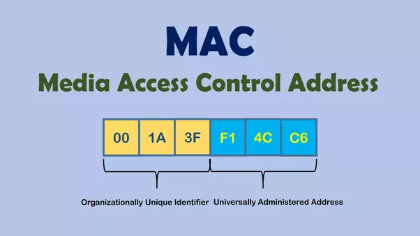

## Fast HTTP Server

    $ cd project-folder
    $ php -S localhost:8000

## References

 - Courses
    - [PHP Do Zero ao Profissional](https://phpdozeroaoprofissional.com.br/)
    - [PHP Programando com Orientação a Objetos e Design Patterns](https://php.com.br/c7?cursos)
    - [Curso Completo de PHP7 - Udemy](https://www.udemy.com/curso-php-7-online/learn/v4/overview)
 - Recommended Books
    - [PHP Programando com Orientação a Objetos - 4 Edição - Pablo Dall'Oglio](https://www.amazon.com.br/PHP-Programando-com-Orienta%C3%A7%C3%A3o-Objetos-ebook/dp/B07G9PQJQR?tag=goog0ef-20&smid=A18CNA8NWQSYHH&ascsubtag=3f9e3157-63ef-45ba-8931-20a081aa9ab1)
 - Sites
    - [PHP.com.br](https://php.com.br)
    - [ThePHPLeague.com](https://thephpleague.com/)
    - [W3Schools PHP7](https://www.w3schools.com/php7/default.asp)
    - [TutorialRepublic PHP7 Tutorial](https://www.tutorialrepublic.com/php-tutorial/)
    - [Celke.com.br](https://celke.com.br/home)
    - [Nic.br](https://www.nic.br/)
    - [Ceweb.br](https://ceweb.br/)
    - [CGI.br](https://cgi.br/)
    - [EnableCORS.org](https://enable-cors.org/)
    - [Php Weekend](http://phpweekend.com.br/)
 - Nice to Know
    - ["Design Patterns" Aren't](https://perl.plover.com/yak/design/)
    - [Crontab](https://www.wikiwand.com/pt/Crontab)
 - GUI Softwares
    - [SequelPRO](https://www.sequelpro.com/)
    - [Dbeaver](https://dbeaver.io/download/)
    - [HeidiSQL](https://www.heidisql.com/)
    - [MySQL WorkBench](https://www.mysql.com/products/workbench/)
 - Events
    - [PhpConference](https://phpconference.com/)
    - [PHP Experience](https://eventos.imasters.com.br/phpexperience/)
    - [PHPRSConf](https://conference.phprs.com.br/)
    - [PHPSCConf](https://conf.phpsc.com.br/)
 - O QUE NÃO FAZER
    - [Gambiarras Design Patterns](https://desciclopedia.org/wiki/Gambi_Design_Patterns)

## Tutorials

 - <?= phpinfo(); ?>
 - [Encontrar Erros no PHP](https://www.adianti.com.br/forum/pt/view_5093)
 - [Instalação PHP Ubuntu 18.04](https://php.com.br/instalacao-php-linux)
 - [Generating a new SSH key pair](https://gitlab.com/help/ssh/README#generating-a-new-ssh-key-pair)
 - [Enabling SSL (https protocol) with xampp in a local PHP project](https://ourcodeworld.com/articles/read/198/enabling-ssl-https-protocol-with-xampp-in-a-local-php-project)
    ```
    # http
    <VirtualHost 127.0.0.2:80>
        DocumentRoot "/opt/lampp/htdocs/loginfacebook"
        DirectoryIndex index.php

        <Directory "/opt/lampp/htdocs/loginfacebook">
            Options All
            AllowOverride All
            Require all granted
        </Directory>
    </VirtualHost>

    # https
    <VirtualHost 127.0.0.2:443>
        DocumentRoot "/opt/lampp/htdocs/loginfacebook"
        ServerName myproject.com
        SSLEngine on
        SSLCertificateFile "etc/ssl.crt/server.crt"
        SSLCertificateKeyFile "etc/ssl.key/server.key"
        <Directory "/opt/lampp/htdocs/loginfacebook">
            Options All
            AllowOverride All
            Require all granted
        </Directory>
    </VirtualHost>
    ```
  - [Interoperabilidade](https://pt.wikipedia.org/wiki/Interoperabilidade)

## Best Practices

- [PSRs](https://www.php-fig.org/psr)
- [Design Patterns For Humans](https://github.com/kamranahmedse/design-patterns-for-humans)
- [PHP The Right Way - Github](https://github.com/PHPSP/php-the-right-way)
- [FIG Standards Aproved- GitHub](https://github.com/php-fig/fig-standards/tree/master/accepted)
- [PHPBestPractices.org](https://phpbestpractices.org)
- [Design Patterns PHP](https://designpatternsphp.readthedocs.io/pt_BR/latest/)

## Unix Permissions

 - Change Mode "chmod" command
    ```
    Permissão Binário   Octal
    ---        000       0
    --x        001       1
    -w-        010       2
    -wx        011       3
    r--        100       4
    r-x        101       5
    rw-        110       6
    rwx        111       7

    x -> execute 
    w -> write
    r -> read

    owner  group  general  unix command      when to use
    ---   ---     ---
    rwx   rwx     rwx 
    421   401     401      sudo chmod 755   -> permissions to directories in production
    420   400     400      sudo chmod 644   -> permissions to files in production
    ```
 - Give all permissions recursively to all files and directories inside the folder
    ```
    $ sudo chmod -R 777 folder/
    ```

## .htaccess

 - Force HTTPS Redirect (Apache HTTP Server)
   - Create .htaccess file inside folder
   - Change example.com to URL https redirection
   ```
   RewriteEngine On 
   RewriteCond %{SERVER_PORT} 80 
   RewriteRule ^(.*)$ https://example.com/$1 [R=301,L]
   ```
- Removing ‘www.’ from your URL (Apache HTTP Server)
   - Create .htaccess file inside folder
   - Change example.com to URL redirection
   ```
   RewriteEngine On
   RewriteCond %{HTTP_HOST} !^example\.com [NC]
   RewriteRule ^(.*)$ https://example.com%{REQUEST_URI} [R=301,L]
   ```

## Apache HTTP Server Configurations

 - [Docs Apache HTTP Server PT-BR](https://httpd.apache.org/docs/trunk/pt-br/)
 - Create New VirtualHost
 ```
 $ cd /opt/lampp/apache2/conf
 $ sudo nano httpd.conf

 <VirtualHost *:80>
    ServerAdmin aleexgvieira@gmail.com
    DocumentRoot "/opt/lampp/htdocs/Learning-PHP7/Platform as a service (Multitenancy)"
    ServerName saas.google.com
    ServerAlias saas.google.com
    ErrorLog "logs/saas.google.com-error_log"
    CustomLog "logs/saas.google.com-access_log" common
</VirtualHost>
 ```
 - Rename LocalHost
 ```
 $ sudo nano /etc/hosts
 
 127.0.0.1   new_localhost_url_here
 127.0.0.1   new_localhost_url_here
 ```

## Bytes World

 - [ASCII CODE - American Standard Code for Information Interchange Table](https://www.ascii-code.com/)
 - 1Kbit = 2^10 = 1024 bits
 - 1KByte = 2^10 * 8 = 8.192 bits
 - 1Mbit = 2^20 = 1.048.576 bits 
 - 1MByte = 2^20 * 8 = 8.388.608 bits
 - 20Mbits = 20 * 2^20 = 20.971.520 bits
 - 20MByte = 20 * 2^20 * 8 = 167.772.160 bits
 - Plano de 100Mbits = (100 * 2^20) / 8 = 104.857.600 / 8 = 13.107.200 bits/s = 13MB/s 

## Redes

 - IPv4 == Internet Protocol Versão 4
    - Formato por 4 bytes (10111011.01101011.11111011.01011011) = 2^32 = 4.294.967.296
    - Example: 192.168.0.1
    - 
 - IPv6 == Internet Protocol Versão 6
    - Versão 6, por falta de endereços suficientes atualmente
    - 3,4x10^38 endereços
    - 
 - MacAddress == Media Access Control
    - Endereço "único" físico associado à interface de comunicação, que conecta um dispositivo à rede.
    - Sua identificação é gravada em hardware, isto é, na memória ROM (Read-Only-Memory).
    - Os três primeiros bytes são destinados a identificação do fabricante - eles são fornecidos pela própria IEEE
    - Os três últimos bytes são definidos pelo fabricante, sendo este responsável pelo controle da numeração de cada placa que produz. Apesar de ser único e gravado em hardware, o endereço MAC pode ser alterado através de técnicas específicas.
    - 
 - HTTP == HyperText Transfer Protocol
    - Utilizado para sistemas de informação de hipermídia e hypertexto
    - HTTP: Port 80
    - HTTPS: Port 443
 - Camada OSI & Protocolos TCP/IP
    - <strong>Transmission Control Protocol</strong> é um conjunto de protocolos de comunicação entre computadores em rede. O conjunto de protocolos pode ser visto como um modelo de camadas (Modelo OSI), onde cada camada é responsável por um grupo de tarefas, fornecendo um conjunto de serviços bem definidos para o protocolo da camada superior. As camadas mais altas, estão logicamente mais perto do usuário (chamada camada de aplicação) e lidam com dados mais abstratos, confiando em protocolos de camadas mais baixas para tarefas de menor nível de abstração. <strong>É orientado a conexão, ou seja, antes de enviar os dados é feito uma comunicação entre o rementente e o destinatário e cria-se um canal de comunicação, então é transmitido os dados. Exemplo de uso: gerenciadores de FTP (File Transfer Protocol), como o FileZilla, pois precisam garantir a integridade do recebimento/envio do arquivo.</strong>
    - Benefícios
       - Padronização: um padrão, um protocolo roteável que é o mais completo e aceito protocolo disponível atualmente. Todos os sistemas operacionais modernos oferecem suporte para o TCP/IP e a maioria das grandes redes se baseia em TCP/IP para a maior parte de seu tráfego.
       - Interconectividade: uma tecnologia para conectar sistemas não similares. Muitos utilitários padrões de conectividade estão disponíveis para acessar e transferir dados entre esses sistemas não similares, incluindo FTP (File Transfer Protocol) e Telnet (Terminal Emulation Protocol).
       - Roteamento: permite e habilita as tecnologias mais antigas e as novas a se conectarem à Internet. Trabalha com protocolos de linha como P2P (Point to Point Protocol) permitindo conexão remota a partir de linha discada ou dedicada. Trabalha como os mecanismos IPCs e interfaces mais utilizados pelos sistemas operacionais, como sockets do Windows e NetBIOS.
       - Protocolo Robusto: escalável, multiplataforma, com estrutura para ser utilizada em sistemas operacionais cliente/servidor, permitindo a utilização de aplicações desse porte entre dois pontos distantes.
       - Internet: é através da suíte de protocolos TCP/IP que obtemos acesso a Internet. As redes locais distribuem servidores de acesso a Internet (proxy servers) e os hosts locais se conectam a estes servidores para obter o acesso a Internet. Este acesso só pode ser conseguido se os computadores estiverem configurados para utilizar TCP/IP.
    - Total de Portas TCP: 2^16 = 65.536
    - <strong>UDP = User Datagram Protocol</strong> é um protocolo simples da camada de transporte. Ele é descrito na RFC 768 e permite que a aplicação envie um datagrama encapsulado num pacote IPv4 ou IPv6 a um destino, porém sem qualquer tipo de garantia que o pacote chegue corretamente (ou de qualquer modo). <strong>Não é orientado a conexão, portanto os dados são enviados sem ter a certeza de que o receptor recebeu os dados. Exemplo de uso: são aqueles que não precisam de garantir a chegada dos dados. Todos os programas de video e voz são do tipo UDP (skype, todos os programas do tipo "Voz sobre IP" e streaming de videos). </strong>
    - <strong>ICMP = Internet Control Message Protocol</strong> é um protocolo integrante do Protocolo IP, definido pelo RFC 792, é utilizado para fornecer relatórios de erros à fonte original. Qualquer computador que utilize IP precisa aceitar as mensagens ICMP e alterar o seu comportamento de acordo com o erro relatado.
       - TYPE (8 bits): identifica o tipo mensagem, por exemplo, se o valor for 8 é uma requisição (echo request). Se o conteúdo for 0 é uma reposta (echo reply).
       - CODE (8 bits): utilizado em conjunto com o campo TYPE para identificar o tipo de mensagem ICMP que está sendo enviada.
       - CHECKSUM (16 bits): verifica a integridade do pacote ICMP.
       - MESSAGE CONTENTS (Tamanho Variável): contém o conteúdo da mensagem ICMP.
    - 
    - <strong>Open System Interconnection</strong> é um modelo de rede de computador com objetivo de ser um padrão, para protocolos de comunicação entre os mais diversos sistemas em uma rede local (Ethernet), garantindo a comunicação entre dois sistemas computacionais (end-to-end) divido em 7 camadas.
    - <strong>PING ou Latência</strong> é um utilitário que usa o protocolo ICMP para testar a conectividade entre equipamentos. É um comando disponível praticamente em todos os sistemas operacionais. Seu funcionamento consiste no envio de pacotes para o equipamento de destino e na "escuta" das respostas. Se o equipamento de destino estiver ativo, uma "resposta" (o "pong", uma analogia ao famoso jogo de ping-pong) é devolvida ao computador solicitante. $ ping -c 5 google.com
    - <strong>Firewal ou Parede de Fogo</strong> é um dispositivo de uma rede de computadores que tem por objetivo aplicar uma política de segurança a um determinado ponto da rede. O firewall pode ser do tipo filtros de pacotes, proxy de aplicações, etc. Os firewalls são geralmente associados a redes TCP/IP.[1]. Este dispositivo de segurança existe na forma de software e de hardware, a combinação de ambos é chamado tecnicamente de "appliance".
    - <strong>Gateway = Ponte de ligação</strong>  possui os seguintes significados:
       - Em uma rede de comunicações, um nó de rede equipado para interfacear com outra rede que usa protocolos diferentes. 
       - Um computador ou programa de computador configurado para realizar as tarefas de um gateway.
       - Para que serve: Organizar o tráfego de informações entre um equipamento final (computador, notebook, smartphone, tablet, etc) e a internet além de “traduzir” as informações entre redes heterogêneas. Isto é, permitir a comunicação entre diferentes ambientes e arquiteturas. Assim, a ferramenta é capaz de converter os dados entre sistemas diferentes, de modo que cada lado seja capaz de “entender” o outro.
       - Exemplos de uso: roteador e firewall.
    - <strong>Proxy = "Procurador ou Representante"</strong> é um servidor (um sistema de computador ou uma aplicação) que age como um intermediário para requisições de clientes solicitando recursos de outros servidores. Um cliente conecta-se ao servidor proxy, solicitando algum serviço, como um arquivo, conexão, página web ou outros recursos disponíveis de um servidor diferente, e o proxy avalia a solicitação como um meio de simplificar e controlar sua complexidade. Um proxy de cache HTTP ou, em inglês, caching proxy, permite por exemplo que o cliente requisite um documento na World Wide Web e o proxy procura pelo documento na sua caixa (cache). Se encontrado, a requisição é atendida e o documento é retornado imediatamente. Caso contrário, o proxy busca o documento no servidor remoto, entrega-o ao cliente e salva uma cópia em seu cache. Isto permite uma diminuição na latência, já que o servidor proxy, e não o servidor original, é requisitado, proporcionando ainda uma redução do uso da largura de banda.
    - <strong>Traceroute</strong> é uma ferramenta de diagnóstico que rastreia a rota de um pacote através de uma rede de computadores que utiliza os protocolos IP e o ICMP. Seu funcionamento está baseado no uso do campo <strong>Time to Live (TTL)</strong> do pacote IPv4[8] destinado a limitar o tempo de vida dele. Este valor é decrementado a cada vez que o pacote é encaminhado por um roteador. Ao atingir o valor zero o pacote é descartado e o originador é alertado por uma mensagem ICMP TIME_EXCEEDED. $ traceroute google.com
    - <strong>PAN = Personal Area Network</strong>  é uma rede doméstica que liga recursos diversos ao longo de uma residência. Através da tecnologia Bluetooth e/ou cabo USB obtém-se uma rede PAN.
    - <strong>LAN = Local Area Network</strong> é um conjunto de hardware e software que permite a computadores individuais estabelecerem comunicação entre si, trocando e compartilhando informações e recursos. Estas redes são denominadas locais por cobrirem uma área bem limitada, porém com o avanço tecnológico a LAN tem ultrapassado os 100 m de cobertura para se estender a uma área maior
    - <strong>MAN = Metropolitan Area Network</strong> são redes maiores que as LANs. Este tipo de rede é caracterizada por ter um alcance maior que as do tipo LAN, abrangendo cidades próximas ou regiões metropolitanas, por exemplo. Em uma definição mais prática, imaginemos por exemplo, que uma empresa possui dois escritórios em uma mesma cidade e deseja que os computadores permaneçam interligados. Para isso existe a rede de área metropolitana, que conecta diversas redes locais dentro de algumas dezenas de quilômetros.
    - <strong>WAN = Wide Area Network</strong> é uma rede de computadores que abrange uma grande área geográfica, com frequência um país ou continente. Um exemplo clássico de uma rede tipicamente WAN é a própria Internet pelo fato de abranger uma área geográfica global, interligando países e continentes.
    - Camadas OSI
       - 
    - Tree Way Handshake
       - 

## Domain

 - 
 - URL = Uniform Resource Locator (Nome do Domínio)
    - https://google.com
 - Subdomínio
    - https://play.google.com
 - URN == Uniform Resource Name    
    - /maps (recurso que será usado na URL)
 - URI == Uniform Resource Identifier    
      - https://google.com/maps (URL + URN)
 - TDL == Top Level Domain ou Domínio de Nível Superior
    - A IANA (Autoridade para Atribuição de Números na Internet) atualmente distingue os seguintes grupos de domínios de topo
       - domínios de topo de código de país (country-code top-level domains ou ccTLD): têm sempre duas letras e derivam do código ISO 3166-1 alpha-2
       - domínios de topo genéricos (generic top-level domains ou gTLD): têm sempre mais do que duas letras
       - domínios de topo patrocinados (sponsored top-level domains ou sTLD)
       - domínios de topo não patrocinados (unsponsored top-level domains)
       - domínios de topo de infraestruturas (infrastructure top-level domain)
       - domínios de topo internacionalizados (internationalized top-level domains ou IDN)
       - domínios de topo de código de país internacionalizado (internationalized country code top-level domains ou IDN ccTLD)
       - domínios de topo em teste (testing top-level domains)
 - DNS == Domain Name System
    - É um sistema hierárquico e distribuído de gerenciamento de nomes para computadores, serviços ou qualquer máquina conectada à Internet ou a uma rede privada.
    - Por padrão, o DNS usa o protocolo User Datagram Protocol (UDP) na porta 53 para servir as solicitações e as requisições.
    - BIND == Berkeley Internet Name Domain é o servidor para o protocolo DNS mais utilizado na Internet, especialmente em sistemas do tipo Unix.
    - 13 Root Servers 
       - https://www.iana.org/domains/root/servers
       - The authoritative name servers that serve the DNS root zone, commonly known as the “root servers”, are a network of hundreds of servers in many countries around the world. They are configured in the DNS root zone as 13 named authorities, as follows.
       ```
       List of Root Servers
       HOSTNAME            IP ADDRESSES    MANAGER
       a.root-servers.net  198.41.0.4,     2001:503:ba3e::2:30 VeriSign, Inc.
       b.root-servers.net  199.9.14.201,   2001:500:200::b University of Southern California (ISI)
       c.root-servers.net  192.33.4.12,    2001:500:2::c  Cogent Communications
       d.root-servers.net  199.7.91.13,    2001:500:2d::d University of Maryland
       e.root-servers.net  192.203.230.10, 2001:500:a8::e  NASA (Ames Research Center)
       f.root-servers.net  192.5.5.241,    2001:500:2f::f Internet Systems Consortium, Inc.
       g.root-servers.net  192.112.36.4,   2001:500:12::d0d  US Department of Defense (NIC)
       h.root-servers.net  198.97.190.53,  2001:500:1::53 US Army (Research Lab)
       i.root-servers.net  192.36.148.17,  2001:7fe::53 Netnod
       j.root-servers.net  192.58.128.30,  2001:503:c27::2:30 VeriSign, Inc.
       k.root-servers.net  193.0.14.129,   2001:7fd::1 RIPE NCC
       l.root-servers.net  199.7.83.42,    2001:500:9f::42  ICANN
       m.root-servers.net  202.12.27.33,   2001:dc3::35  WIDE Project
       ```

## Cloud

 - 
 - <strong>SaaS</strong>
    - O SaaS (Software como Serviço) permite aos usuários se conectar e usar aplicativos baseados em nuvem pela Internet. Exemplos comuns são email, calendário e ferramentas do Office (como Microsoft Office 365).
    - O SaaS fornece uma solução de software completa que você pode comprar em um regime pré-pago de um provedor de serviço de nuvem. Você pode alugar o uso de aplicativo para sua organização e seus usuários se conectarem a ele pela Internet, normalmente por um navegador da Web. Toda a infraestrutura subjacente, middleware, software de aplicativo e dados de aplicativo ficam no datacenter do provedor de serviços. O provedor de serviço gerencia hardware e software e, com o contrato de serviço apropriado, garante a disponibilidade e a segurança do aplicativo e de seus dados.
    - <em>Exemplo: Apps/aplicativos hospedados (Office 365, Google Docs)</em>
    - <strong>PaaS</strong>
       - PaaS (Plataforma como serviço) é um ambiente de desenvolvimento e implantação completo na nuvem, com recursos que permitem a você fornecer tudo, de aplicativos simples baseados em nuvem a sofisticados aplicativos empresariais habilitados para a nuvem. Você adquire os recursos necessários por meio de um provedor de serviços de nuvem em uma base pré-paga e os acessa por uma conexão com a Internet segura.
       - Assim como IaaS, PaaS inclui infraestrutura – servidores, armazenamento e rede –, além de middleware, ferramentas de desenvolvimento, serviços de BI (business intelligence), sistemas de gerenciamento de banco de dados e muito mais. PaaS é criado para dar suporte ao ciclo de vida do aplicativo Web completo: compilação, teste, implantação, gerenciamento e atualização.
       - <em>Exemplo: Ferramentas de desenvolvimento, gerenciamento de banco de dados, análise de negócios, Sistemas operacionais.</em>
       - <strong>IaaS</strong>
          - IaaS (Infraestrutura como serviço) é uma infraestrutura de computação instantânea, provisionada e gerenciada pela Internet. Escale ou reduza verticalmente com demanda e pague somente pelo que usar.
          - IaaS ajuda a evitar gastos e complexidade de comprar e gerenciar seus próprios servidores físicos e outras infraestruturas do datacenter. Cada recurso é oferecido como um componente de serviço separado e você só pode alugar um específico pelo tempo que precisar. O provedor de serviços de computação em nuvem gerencia a infraestrutura, enquanto você adquire, instala, configura e gerencia seu próprio software – sistemas operacionais, middleware e aplicativos.
          - <em>Exemplo: Servidores e armazenamento  Segurança/firewalls de rede Construção/planta física do datacenter</em>


## Tools
    
 - Composer
    - https://getcomposer.org
    - https://packagist.org
       - https://packagist.org/search/?q=coffecode&reason=vendor_not_found
    - http://platesphp.com/
 - HTTP Servers
    - [XAMPP](https://www.apachefriends.org/index.html)
 - MySQL
    - [DB4Free.net](https://db4free.net)
 - [cPanel](https://cpanel.com/)
    - cPanel: 2082
    - cPanel  HTTPS: 2083
    - WHM: 2086
    - WHM HTTPS: 2087
    - Webmail: 2095
    - Webmail  HTTPS: 2096
 - FTP - File Transfer Protocol
    - Default Port: 21
    - Webdisk: 2077
    - Webdisk HTTPS: 2078
    - [FileZilla](https://filezilla-project.org/)
 - REST APIs
    - [GuzzlePHP](http://docs.guzzlephp.org/en/stable/)
    - [REST TestTest](https://resttesttest.com/)
    - [Insomnia](https://insomnia.rest/)
    - [Postman](https://www.getpostman.com/)
 - Benchmark
    - [PHPBench](https://phpbench.com/)
 - Open Source Forum
    - [Flarum](https://github.com/flarum/flarum)
 - Insights
    - [New Relic](https://newrelic.com/)
 - Perfomance
    - [Amazon CloudFront](https://aws.amazon.com/cloudfront)
    - [MemCachier](https://www.memcachier.com/)
    - [Fastly](https://www.fastly.com/)
 - Code Quality
    - [CodeClimate](https://codeclimate.com/)
 - DataBase as a Service
    - [OpenRedis](https://openredis.com/)
    - [Heroku PostgreSQL](https://www.heroku.com/postgres)
 - Documentation 
    - [PHPDoc](https://www.phpdoc.org/)
 - Pagamentos
    - [Pagar.me](https://pagar.me/)
    - [Boleto PHP](https://boletophp.com.br/)
    - [GerenciaNet](https://gerencianet.com.br/)
 - Image Optimization
    - [Squoosh](https://squoosh.app/)
 - Graphics
    - [ChartJS](http://www.chartjs.org/)
 - Public LocalHost
    - [NGrok](https://ngrok.com/)
 - Reset CSS
    - [Normalize.CSS](https://necolas.github.io/normalize.css/)
 - Usefull Plugins Chrome
    - [Window Resizer](https://chrome.google.com/webstore/detail/window-resizer/kkelicaakdanhinjdeammmilcgefonfh?hl=pt-BR)
 - SMTP - Simple Mail Transfer Protocol
    - [MailGun](https://www.mailgun.com/)
    - [SendGrid](https://sendgrid.com/)
    - SMTP Gmail
       - Nome do servidor SMTP Gmail: smtp.gmail.com
       - Usuario SMTP Gmail: o seu endereço Gmail
       - Password SMTP Gmail: a sua password
       - Porta SMTP do Gmail (TLS): 587.
       - Porta SMTP do Gmail (SSL): 465.
    - "Protocolo de transferência de correio simples" 
    é o protocolo padrão para envio de e-mails através da Internet, definido na RFC 821.
    - É um protocolo relativamente simples, em texto plano, onde um ou vários destinatários de uma mensagem 
    são especificados (e, na maioria dos casos, validados) sendo, depois, a mensagem transferida.
    - SMTP: Port 587
    - SMTP + SSL: Port 465
    - SMTP + TLS: Port 587 (recomendado)
 - POP3 == Post Office Protocol. 
    - O POP3 permite que um cliente faça download de um e-mail de um servidor de e-mail. 
    - O protocolo POP3 é simples e não oferece muitos recursos, excepto para download. 
    - O seu conceito pressupõe que o cliente de e-mail faça download de todo o e-mail disponível no servidor, apaga-os do servidor e, em seguida, desliga-se. 
    - Ao utilizar este procolo, irá conseguir visualizar os seus emails caso não tenha acesso à Internet.
    - POP3: Port 110
    - POP3  + SSL: Port 995
    - POP3 + TLS: Port 110 (recomendado)
 - IMAP == Internet Message Access Protocol. 
    - O IMAP partilha muitos recursos semelhantes com o POP3.  
    Também é um protocolo que um cliente de e-mail pode usar para fazer download de e-mails de um servidor de e-mail. No entanto, o IMAP inclui mais recursos do que POP3. 
    - O protocolo IMAP foi desenvolvido para permitir que os utilizadores mantenham seus e-mails no servidor. 
    - O IMAP requer mais espaço em disco no servidor e no geral mais recursos de servidor do que POP3, já que todos os e-mails são armazenados no servidor. 
    - Ao utilizar este procolo, apenas irá conseguir visualizar os seus emails, caso não tenha acesso à Internet, se o seu cliente de e-mail estiver configurado especificamente para tal.
    - IMAP: Port 143
    - IMAP + SSL: Port 993
    - IMAP + TLS: Port 143 (recomendado)
    - Tools
       - [Amazon Simple Email Service](https://aws.amazon.com/ses/)
       - [PHP Mailer](https://github.com/PHPMailer/PHPMailer)
       - [MailCatcher](https://mailcatcher.me/)
       - [MailTrap](https://mailtrap.io/)
       - [SendGrid](https://sendgrid.com/)
       - [MailGun](https://www.mailgun.com/)
 - CEP
    - [ViaCEP](http://viacep.com.br/)
 - PDF
    - [mPDF](https://mpdf.github.io/)
 - JSON
    - [JSONEditorOnline.org](http://jsoneditoronline.org/)
 - Monitoring Server
    - [UpTime Robot](https://uptimerobot.com/)
 - Testing
    - [PHP Unit](https://phpunit.de/)
    - [XDebug](https://github.com/xdebug/xdebug)
    - [BlackFire](https://blackfire.io/)
 - Security
    - [Security Sensio Labs](https://security.sensiolabs.org/)
 - Interaction controls to your HTML tables
    - [DataTables.net](https://datatables.net/)
 - BarCode Generator
    - [Picqer](https://github.com/picqer/php-barcode-generator)      
 
## PSRs

 - 1 = Basic Coding Standard
    - Arquivos sempre devem utilizar apenas o <?php
    - Sempre salvar arquivos PHP em UTF-8 sem BOM
    - Arquivos devem OU declarar simbolos (classes, functions, constantes, etc...) OU efeitos-colaterais (escrever algo na tela, dar um output)
    - Classes devem sempre usar um sistema de autoload (PSR 0, PSR 4)
    - Nomes de classes devem sempre utilizar StudlyCaps
    - Constantes devem sempre ser MAIUSCULAS ou com UNDERSCORE
    - Nomes de métodos de classes devem seguir o padrão camelCase
- 2 = Coding Style Guide
    - O código deve seguir a PSR-1
    - O código deve usar identação de 4 espaços, não tabs
    - Cada linha deve ter 80 caracteres, no máximo 120, ou menos
    - Após a declaração do namespace ou use, deve se ter uma linha em branco
    - A abertura e fechamento das classes devem ser feitas na próxima linha.
    - A Abertura e fechamento dos métodos devem ser feitas na próxima linha.
    - A visibilidade deve ser declarada em todas as propriedades na próxima linha
    - Condicionais devem ter um espaço entre elas, nas funções/métodos não.
    - A abertura das condicionais devem ser feitas na mesma linha. O fechamento na  próxima.
    - Os parâmetros das funções/métodos, não devem conter espaços no começo e no fim.

