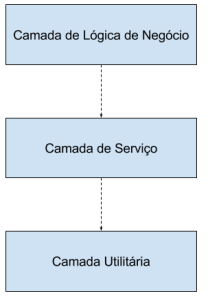

## SOLID - O Princípio da Inversão de Dependências

#### Source/Credits: http://ramonsilva.net/boas-praticas/solid/inversao-de-dependencias/

 - O princípio da Inversão de Dependências é o último dos Princípios SOLID e corresponde a letra “I”.

 - Definição
    - Este princípio trata de uma maneira específica para desacoplar as dependências entre os objetos, modificando a maneira tradicional como estabelecemos as dependências entre nossos objetos.

 - Sua definição formal é :
 - Componentes de mais alto nível não devem depender de componentes de níveis mais baixos, mas ambos devem depender de abstrações.
 - Abstrações não devem depender de implementações, mas as implementações devem depender de abstrações.
 - O princípio inverte a maneira como pensamos o nosso design de software, nos induzindo a fazer com que tanto nossos módulos de alto nível quanto os de baixo nível dependam de uma mesma abstração.

 - Esquema Tradicional de Design em Camadas

 <br>
 <p align="center">
    
  </p>
 <br>

 - Em um esquema tradicional de desenvolvimento de software, os componentes de nível inferior são projetados para serem consumidos por módulos de nível superior, de modo que estes possam ir incrementando de complexidade conforme o sistema vai sendo construído.

 - Neste modelo arquitetural, os componentes da camada superior dependem dos componentes mais baixos apenas para que possam realizar alguma tarefa, isto reduz as possibilidades de reuso dos componentes de alto nível, devido ao excessivo acoplamento entre os componentes.

 - O Objetivo deste princípio então, é a redução do acoplamento entre os componentes através de uma camada de abstração.

 - Inversão de Propriedade
    - Com a adição dessa camada , ambos os componentes superior e inferior evitam a interdependência, e passam a depender de uma abstração. Mesmo tendo o conceito e inversão, não significa que a camada inferior passa a depender da superior. Ambas as camadas passam a depender dessa abstração que atrai o comportamento necessário para as camadas superiores.

 <br>
 <p align="center">
    
  </p>
 <br>

 - Na aplicação direta do princípio da inversão de dependências, as abstrações pertecem as camadas superiores, sendo assim as camadas inferiores herdam/implementam as interfaces dessas abstrações.

 - A inversão de dependências encoraja a reutilização dos componentes de camadas superior, que contêm as maior parte da lógica de verdade. As camadas superiores podem conter diferentes implementações das camadas inferiores, enquanto as camadas inferiores podem ser fechadas ou extensíveis, conforme a sua necessidade.

 - É bastante común usar o padrão de projeto Adapter para fazer o intermédio entre as camadas de negócio e serviço.

 - Construindo uma camada de abstração
    - todas as variáveis membro da classe devem ser interfaces ou classes abstratas
    - todos os pacotes contendo classes concretas devem se comunicar somente através de interfaces ou classes abstratas
    - Nenhuma classe deve derivar de uma outra classe concreta
    - Nenhum método deve sobrescrever um método já implementado
    - Todas as instâncias de objetos devem ser criadas através de Padrões de Projetos de criação como Factory ou Injeção de Dependências.

 - Violando a Inversão de Dependências

```java
class Funcionario {
    private String cargo;
    private float salario;
    private float comissao;
    
    public String getSalario(){
        return this.salario + this.getComissao();
    }
    
    public float getComissao(){
        return this.comissao;
    }
    
    public String getCargo(){
        return this.cargo;
    }
    
}

class Pagamento {

    private Funcionario funcionario;

    public float getSalario(){
        if(funcionario.getCargo() == "Representante"){
            return funcionario.getComissao();
        }
        
        return funcionario.getSalario();
    }
}
```

 - O código acima viola o Princípio de Inversão de Dependências pois a classe Pagamento conhece os detalhes da implementação de Funcionário, ou seja, Pagamento depende da implementação de Funcionário e não da sua abstração, o que deixa o código fortemente acoplado.
 - Abaixo temos a refatoração para adicionar camadas de abstração.
    - Camadas de Abstração
    - E o nosso novo código.

```java
interface Pagavel {
    float getRemunecao();
}

class Funcionario implements Pagavel {
    private String cargo;
    private float salario;
    private float comissao;
    
    public String getCargo(){
        return this.cargo;
    }
    
    @Override
    public float getRemunercao(){
        float remunercao = this.salario;
        
        if(this.getCargo() != "Reprensentante"){
            remuneracao  = remunercao + comissao;
        }
        
        return remuneracao;
    }
    
}

class Pagamento implements Pagador {

    private Pagavel pagavel;

    public void setPagavel(Pagavel pagavel){
        this.pagavel = pagavel;
    }
    
    public float getSalario(){
        return pagavel.getSalario();
    }
}

class PagamentoService {
    private Pagavel pagavel;
    private Pagador pagador;
    
    public PagamentoSerivce(Pagador pagamento, Pagavel funcionario){
        this.pagador = pagamento;
        this.pagavel = funcionario;
        
        this.pagador.setPagavel(this.pagavel);
    }
    
    public float getPagamento(){
        return this.pagador.getSalario();
    }
}
```

 - Criamos duas interfaces, Pagável que é a abstração para o Funcionário e Pagador que é uma abstração para Pagamento. Por fim criamos uma camada intermediária que chamamos nesse caso de serviço, para que ela gerencie os Pagadores e os Pagáveis.

 - Containers de Injeção de Dependências
    - Inversão de dependências é um princípio muito utilizado, e presente na maioria dos frameworks mais conhecidos. Existem frameworks que se especializaram em fazer essa inversão, entre eles temos o Spring, PicoContainer, Castle Windsor, StructureMap, Unity entre outros.
 - Conclusão
    - Seguindo este princípio mantemos nossa arquitetura com um baixo nível de acoplamento. A princípio para ser uma tarefa chata e até mesmo desnecessária. Mas tudo que é necessário, importante e trabalhoso, acaba por ser automatizado, por isso temos tantos frameworks e containers que realizam boa parte do trabalho repetitivo por nós.